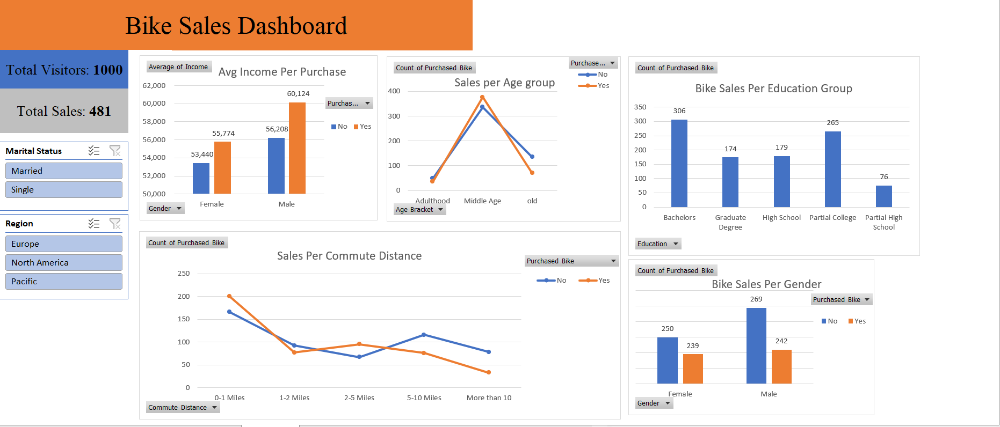

# Project Overview

To help the bike selling company gather insights from data and make meaningful decisions that can drive in more customers and increase profit.

## Tools Used

Excel (Sum & Functions, Pivot Tables, and Dashboard)

## Project Files

[Project files](https://github.com/Samyakbansod97/Bike-Sales)

## Project Steps

- Used Sum & Functions to create custom columns and cleaned data using Excel
- Transferred clean data into Pivot Table to gather insights
- Used Excel’s built-in charts option to prepare an Interactive Dashboard.

## Final Dashboard Picture

## Findings

This interactive dashboard prepared in Excel represents customers from different backgrounds and can be filtered by regions and marital status. The dashboard shows customers from different age groups, average income of customers, and educational backgrounds, all of which can be very useful to prepare customized marketing and promotional strategies to drive in more profit.
